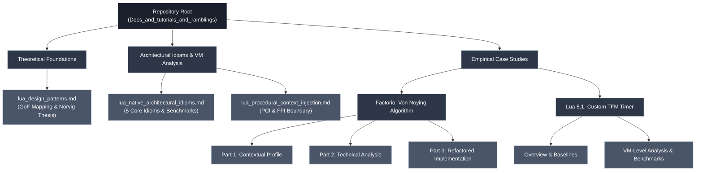

# Native Lua Architecture: Research, VM Analysis, and Application

- This repository serves as a technical archive documenting the research, empirical analysis, and practical application of software architecture patterns within the Lua ecosystem (specifically Lua 5.1 and LuaJIT). 

- Rather than presenting abstract design tutorials, this collection traces the lifecycle of architectural concepts. 
- It examines how traditional Object-Oriented Design Patterns (GoF) dissolve or adapt when constrained by Lua's specific runtime mechanics—such as its table implementation, lack of compile-time macros, and garbage collection behavior. 
- The research moves from theoretical mapping (e.g., Peter Norvig's analysis of dynamic languages) to VM-level profiling (bytecode dispatch, cache locality, trace compiler limits), culminating in real-world case studies where these idioms are applied to refactor complex, performance-critical systems.

## Repository Structure

- The following diagram illustrates the logical organization of the research, theoretical documentation, and empirical case studies within the repository.



---

## Documentation Index

### Theoretical Foundations
* **[Lua Design Patterns: Translating GoF into Native Idioms](./lua_design_patterns.md)**  
  An academic analysis of the 23 Gang of Four patterns through the lens of Peter Norvig’s 1998 thesis on dynamic languages. 
  This document maps traditional OOP concepts to Lua's runtime primitives (first-class functions, closures, tables) and establishes the theoretical baseline for why certain patterns become trivial or invisible in Lua compared to Lisp, Java or C++.

### Architectural Idioms & VM Analysis
* **[Native Lua Architectural Idioms](./lua_native_architectural_idioms.md)**  
  An examination of five core architectural idioms (Direct Hash Dispatch, Explicit Context Passing, Table Recycling, Sequential Phase Execution, and Environment Injection). 
  This document provides progressive refactoring examples (Naive -> OOP -> Idiomatic) and evaluates them against LuaJIT trace compiler constraints and GC pressure.
* **[Procedural Context Injection (PCI)](./lua_procedural_context_injection.md)**  
  A technical breakdown of PCI as Lua's lightweight equivalent to Dependency Injection. 
  It analyzes the mechanics of flat `ctx` tables, elimination of `_ENV` global lookups, and the specific advantages of flat memory layouts when crossing the Lua-to-C FFI boundary.

### Empirical Case Studies
* **The Von Noying Algorithm (Factorio)**  
  A 3-part applied research project refactoring Chris Uehlinger's 1000 SPM self-expanding Factorio factory.
  * **Part 1:** Contextual profile and identification of architectural debt.
  * **Part 2:** Analysis of data structures, algorithmic bottlenecks, and GoF pattern misapplications.
  * **[Part 3: Refactored Implementation](./refactored_implementation.md):** The practical application of PCI and Minimal-Overhead Dispatchers to eliminate UPS degradation, complete with memory and execution speed benchmarks.
* **Custom TFM Timer (Transformice / Lua 5.1)**  
  An empirical study on the evolution of a high-frequency timer system within the strict constraints of the standard Lua 5.1 interpreter (No JIT). 
  This study isolates variables to expose hidden VM-level bottlenecks, including the **Hash Lookup Tax** (`luaH_getstr` vs. array memory offsets), the **`OP_CALL` Penalty** (C-stack `CallInfo` allocation overhead vs. inline `OP_TEST`), and **O(N²) Cache Thrashing** caused by `table.remove` inside tight loops.

---

## Research Scope & Target Audience

The documentation is structured to address different levels of architectural inquiry:

| Audience | Focus Area | Documented Evidence |
| :--- | :--- | :--- |
| **Novice** | Progressive Refactoring | Step-by-step code shifts demonstrating exactly *why* global variables and `if/elseif` chains introduce structural and performance debt, and how to systematically refactor them. |
| **Intermediate** | Industry Translation | "Rosetta Stone" mappings that translate Lua-specific idioms to standard industry concepts (e.g., mapping PCI to Dependency Injection, Hash Dispatch to the Strategy Pattern). |
| **Expert** | VM-Level Empirical Data | Rigorous profiling methodologies (warmup phases, GC halting), LuaJIT trace-compiler analysis, Lua 5.1 C-backend bytecode profiling (`OP_CALL` vs `OP_TEST`), and FFI boundary marshaling costs. |

---

## Key Investigated Concepts

* **Pattern Dissolution in Dynamic Languages:** How Lua's runtime tables and closures replace compile-time macro expansion (Lisp) and static class hierarchies (C++/Java).
* **Minimal-Overhead Dispatch:** Replacing $O(n)$ conditional branching with $O(1)$ hash table lookups and data-driven priority tables.
* **GC Starvation & Memory Layout:** Reusing tables in hot paths (Object Pooling) and organizing data for CPU cache locality to guarantee flatline frame times.
* **The Hash Lookup Tax:** Bypassing string hash resolution by storing direct table references in contiguous arrays (Array Part vs. Hash Part).
* **Interpreter Dispatch Weight:** Quantifying the hidden C-stack `OP_CALL` penalty versus inline bytecode execution in pure Lua 5.1 environments.
* **FFI Boundary Optimization:** Structuring Lua data to map directly to C-structs without expensive marshaling or metatable unpacking.
* **Trace-Friendly Architecture:** Avoiding `__index` metamethods and closure allocations in tight loops to prevent LuaJIT trace aborts.

## License

- This repository and its documentation are licensed under the MIT License. 
- See the [LICENSE](LICENSE) file for more details.
```