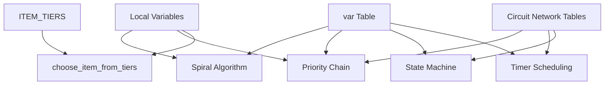
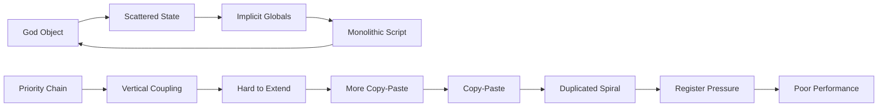
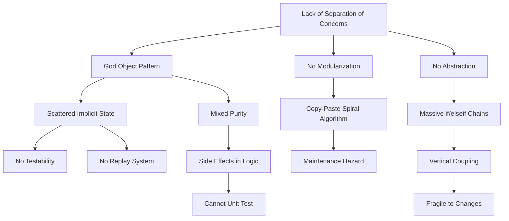

# Original algorithm - Data Structures, Algorithms, and Design Patterns Analysis

**Author**: Vit0rg  
**Created**: June 20th 2026  
**Document last updated:** June 21st 2026 
**Based on**: 
[The algorithm](https://gist.github.com/chrisuehlinger/c38fff88b7e429c81c2582430a2c3ab9)
[Factorio Automated: A 1000SPM self-expanding factory built with bots and Lua](https://youtu.be/PGiTkkMOfiw)
**License**: MIT  

---

## Table of Contents
- [Introduction](#introduction)
- [Data Structures Analysis](#data-structures-analysis)
    - [1. The `var` Table](#1-the-var-table)
    - [2. Circuit Network Tables](#2-circuit-network-tables)
    - [3. ITEM_TIERS Lookup Table](#3-item_tiers-lookup-table)
    - [4. Local Variable Register Allocation](#4-local-variable-register-allocation)
- [Algorithms Analysis](#algorithms-analysis)
    - [1. Ulam Spiral Coordinate Calculation](#1-ulam-spiral-coordinate-calculation)
    - [2. Linear Search in `choose_item_from_tiers()`](#2-linear-search-in-choose_item_from_tiers)
    - [3. Priority-Based Decision Chain](#3-priority-based-decision-chain)
    - [4. Timer-Based Research Scheduling](#4-timer-based-research-scheduling)
    - [5. State Machine (Survey/Pave Modes.)](#5-state-machine-surveypave-modes)
- [Design Patterns Analysis](#design-patterns-analysis)
    - [1. God Object Pattern (Anti-Pattern)](#1-god-object-pattern-anti-pattern)
    - [2. Monolithic Script Pattern (Anti-Pattern)](#2-monolithic-script-pattern-anti-pattern)
    - [3. Implicit Global Pattern (Anti-Pattern)](#3-implicit-global-pattern-anti-pattern)
    - [4. Copy-Paste Pattern (Anti-Pattern)](#4-copy-paste-pattern-anti-pattern)
    - [5. Priority Chain Pattern (Code Smell)](#5-priority-chain-pattern-code-smell)
    - [6. Lookup Table Pattern (Good Pattern)](#6-lookup-table-pattern-good-pattern)
    - [7. State Machine Pattern (Good Pattern, Poor Implementation)](#7-state-machine-pattern-good-pattern-poor-implementation)
- [Summary Table](#summary-table)
- [Code Interactions Graphs](#code-interactions-graphs)
    - [Data Structure -> Algorithm Dependencies](#data-structure-to-algorithm-dependencies)
    - [Anti-Pattern Synergies Analysis](#anti-pattern-synergies-analysis)
    - [Root Cause Chain](#root-cause-chain)
- [Next Steps](#next-steps)
- [References](#references)

---

## Introduction
- The script demonstrates several anti-patterns that make it fragile and hard to maintain. 
- But also contains some good patterns that are just poorly implemented:
    - Lookup tables
    - State machines
- The core issues are:
    - Lack of *separation of concerns* 
    - Reliance on *implicit global state*.
---

## Data Structures Analysis

### 1. The `var` Table

**Structure:**
```lua
var = {
    doneInit = false,
    tilesBuilt = 0,
    lastSignal = 0,
    last_nuclear_megatile = 0,
    researchDeadline = math.huge,
    need_artillery = false,
    need_power = false,
    currently_in_power_shock = false,
    is_surveying = false,
    is_paving = false,
    megablock_x = 0,
    megablock_y = 0,
}
```

**Assessment:**
- **Type:** Unstructured key-value store (dictionary/hash map)
- **Problem:** 
    - This is a **God Object anti-pattern**. 
    - All mutable state is dumped into a single table with no encapsulation, validation, or type safety.
- **Issues:**
  - No schema validation - any code can add/remove fields
  - No access control - any function can mutate any field
  - Mixed concerns - state for power, surveying, paving, and megatile tracking are all in one place
  - No initialization guarantees - fields can be nil if not explicitly set
  - Impossible to snapshot/restore cleanly without deep copying the entire table

**Better Pattern:** Separate state into domain-specific structs:
```lua
state = {
    power = { need_power = false, last_nuclear_megatile = 0 },
    survey = { is_surveying = false, megablock_x = 0, megablock_y = 0 },
    expansion = { tilesBuilt = 0, is_paving = false },
}
```

---

### 2. Circuit Network Tables

**Structure:**
```lua
-- Implicit globals provided by Factorio
red = {
    ['signal-info'] = 15,
    ['signal-dot'] = 3,
    ['signal-A'] = 50,
    ['uranium-fuel-cell'] = 95,
    -- ... 10+ more signals
}

green = {
    ['uranium-ore'] = 150000,
    ['iron-ore'] = 500000,
    -- ... resource scanner data
}
```

**Assessment:**
- **Type:** Sparse hash maps (dictionaries)
- **Problem:** These are **implicit globals** with no type safety or nil-checking discipline.
- **Issues:**
  - Every access requires `or 0` fallback: `red['signal-info'] or 0`
  - No schema - you don't know what keys exist without reading the entire script
  - No validation - values could be strings, numbers, or nil
  - Performance cost - hash table lookups on every tick for 15+ signals

**Better Pattern:** Explicit input parsing with validation:
```lua
local function parse_inputs(red, green)
    return {
        megatiles = tonumber(red['signal-info']) or 0,
        research_tiles = tonumber(red['signal-dot']) or 0,
        construction_bots = tonumber(red['signal-A']) or 0,
        resources = {
            uranium = tonumber(green['uranium-ore']) or 0,
            iron = tonumber(green['iron-ore']) or 0,
        },
    }
end
```

---

### 3. ITEM_TIERS Lookup Table

**Structure:**
```lua
ITEM_TIERS = {
    {
        name = "speed-module",
        signal = "signal-S",
        tiers = {
            { name = "speed-module", count = 1 },
            { name = "speed-module-2", count = 1 },
            { name = "speed-module-3", count = 1 },
        }
    },
    {
        name = "productivity-module",
        signal = "signal-P",
        tiers = {
            { name = "productivity-module", count = 1 },
            { name = "productivity-module-2", count = 1 },
            { name = "productivity-module-3", count = 1 },
        }
    },
    -- ... more module types
}
```

**Assessment:**
- **Type:** Array of structured records (array of tables)
- **Quality:** This is actually a **reasonable data structure** for the problem domain.
- **Strengths:**
  - Declarative - data is separated from logic
  - Extensible - adding a new module type is just adding a table entry
  - Self-documenting - the structure is clear
- **Weaknesses:**
  - Hardcoded - not loaded from external config
  - No validation - typos in field names won't be caught
  - Linear search required to find matching tier

**Better Pattern:** Index by signal name for O(1) lookup:
```lua
ITEM_TIERS_BY_SIGNAL = {
    ['signal-S'] = { /* speed module tiers */ },
    ['signal-P'] = { /* productivity module tiers */ },
}
```

---

### 4. Local Variable Register Allocation

**Structure:**
```lua
local currently_constructed_megatiles = red['signal-info']
local currently_constructed_research_tiles = red['signal-dot']
local available_logistic_bots = red['signal-A']
local available_construction_bots = red['signal-B']
local total_construction_bots = red['signal-C']
local uranium_fuel_cells = red['uranium-fuel-cell']
local nuclear_reactors = red['nuclear-reactor']
-- ... 8 more
```

**Assessment:**
- **Type:** Manual register allocation (15+ locals)
- **Problem:** This is **register pressure** - each local consumes a CPU register in Lua's VM.
- **Issues:**
  - 15+ locals at file scope means they persist across ticks
  - Each requires a hash table lookup on every tick
  - No grouping - related values are scattered
  - Naming is verbose and inconsistent

**Better Pattern:** Group into a single input struct:
```lua
local input = {
    megatiles = red['signal-info'] or 0,
    research_tiles = red['signal-dot'] or 0,
    bots = {
        logistic = red['signal-A'] or 0,
        construction = red['signal-B'] or 0,
        total_construction = red['signal-C'] or 0,
    },
    power = {
        fuel_cells = red['uranium-fuel-cell'] or 0,
        reactors = red['nuclear-reactor'] or 0,
    },
}
```

---

## Algorithms Analysis

### 1. Ulam Spiral Coordinate Calculation

**Algorithm:**
```lua
local n = ...
local x = -1; local y = 0
local steps = 0; local max_steps = 1; local turns_taken = 0
for i = 2, n, 1 do
    steps = steps + 1
    if steps == max_steps then
        steps = 0
        turns_taken = turns_taken + 1
    end
    if steps == 0 and turns_taken % 2 == 0 then
        max_steps = max_steps + 1
    end
    if turns_taken % 4 == 0 then x = x - 1
    elseif turns_taken % 4 == 1 then y = y - 1
    elseif turns_taken % 4 == 2 then x = x + 1
    elseif turns_taken % 4 == 3 then y = y + 1
    end
end
```

**Assessment:**
- **Type:** Iterative coordinate generation (O(n) time, O(1) space)
- **Correctness:** Generates Ulam spiral coordinates correctly
- **Complexity:** 
  - Time: O(n) - must iterate from 2 to n
  - Space: O(1) - only uses a few local variables
- **Issues:**
  - **Duplicated 4 times** - massive code duplication
  - **No memoization** - recalculates from scratch every time
  - **No closed-form solution** - could use mathematical formula for O(1)
  - **Impure** - modifies x, y in place rather than returning values

**Better Algorithm (Closed-form O(1)):**
```lua
local function spiral_coordinate(n)
    if n == 1 then return 0, 0 end
    
    local k = math.ceil((math.sqrt(n) - 1) / 2)
    local t = 2 * k + 1
    local m = t^2
    t = t - 1
    
    if n >= m - t then
        return k - (m - n), -k
    else
        m = m - t
    end
    
    if n >= m - t then
        return -k, -k + (m - n)
    else
        m = m - t
    end
    
    if n >= m - t then
        return -k + (m - n), k
    else
        return k, k - (m - n - t)
    end
end
```

**Even Better (Memoized):**
```lua
local spiral_cache = {}
local function get_spiral_coordinate(n)
    if spiral_cache[n] then
        return spiral_cache[n].x, spiral_cache[n].y
    end
    
    -- Calculate and cache
    local x, y = calculate_spiral(n)
    spiral_cache[n] = { x = x, y = y }
    return x, y
end
```

---

### 2. Linear Search in `choose_item_from_tiers()`

**Algorithm:**
```lua
local function choose_item_from_tiers(signal_name, available_items)
    for _, item_group in ipairs(ITEM_TIERS) do
        if item_group.signal == signal_name then
            for i = #item_group.tiers, 1, -1 do
                local currrent_item = item_group.tiers[i]
                if available_items[currrent_item.name] then
                    return currrent_item.name
                end
            end
            -- check_again fallback (duplicated logic)
            for i = #item_group.tiers, 1, -1 do
                local currrent_item = item_group.tiers[i]
                if available_items[currrent_item.name] then
                    return currrent_item.name
                end
            end
        end
    end
    return nil
end
```

**Assessment:**
- **Type:** Linear search through nested arrays
- **Complexity:**
  - Time: O(g * t) where g = number of item groups, t = tiers per group
  - Space: O(1)
- **Issues:**
  - **Linear scan** - must check every group until match found
  - **Duplicate logic** - the "check_again" loop is identical to the first loop
  - **Typo** - `currrent_item` (three r's) is used consistently
  - **No early exit** - even after finding the group, continues checking tiers in reverse

**Better Algorithm (Hash-based O(1)):**
```lua
-- Pre-build index at initialization
local ITEM_TIERS_INDEX = {}
for _, item_group in ipairs(ITEM_TIERS) do
    ITEM_TIERS_INDEX[item_group.signal] = item_group.tiers
end

local function choose_item_from_tiers(signal_name, available_items)
    local tiers = ITEM_TIERS_INDEX[signal_name]
    if not tiers then return nil end
    
    -- Search from highest tier to lowest
    for i = #tiers, 1, -1 do
        if available_items[tiers[i].name] then
            return tiers[i].name
        end
    end
    
    return nil
end
```

---

### 3. Priority-Based Decision Chain

**Algorithm:**
```lua
if currently_constructed_megatiles == 1 then
    newSignal = 106
elseif green['uranium-ore'] > 100000 or ... then
    newSignal = 1
elseif var.need_power then
    if currently_constructed_megatiles > 10 and ... then
        newSignal = 106
    else
        newSignal = 2
    end
elseif currently_constructed_megatiles < 9 then
    newSignal = 2
elseif lastSignal ~= 110 and (...) then
    newSignal = 110
else
    newSignal = 1
end
```

**Assessment:**
- **Type:** Linear priority chain (if/elseif ladder)
- **Complexity:**
  - Time: O(n) where n = number of conditions
  - Space: O(1)
- **Issues:**
  - **Vertical coupling** - adding a new condition requires editing the middle of the chain
  - **Deep nesting** - up to 7 levels deep
  - **Mixed concerns** - power logic, resource logic, and megatile logic are interleaved
  - **No early exit optimization** - evaluates conditions in order even if a later condition is more likely

**Better Algorithm (Priority Table):**
```lua
local MEGATILE_PRIORITY = {
    { predicate = function(ctx) return ctx.input.megatiles == 1 end,
      handler = function(ctx) return 106 end },
    { predicate = function(ctx) return ctx.input.resources.uranium > 100000 end,
      handler = function(ctx) return 1 end },
    { predicate = function(ctx) return ctx.state.power.need_power end,
      handler = function(ctx)
          if ctx.input.megatiles > 10 and ctx.input.power.fuel_cells > 90 then
              return 106
          else
              return 2
          end
      end },
    -- ... more entries
}

local function select_megatile(ctx)
    for _, entry in ipairs(MEGATILE_PRIORITY) do
        if entry.predicate(ctx) then
            return entry.handler(ctx)
        end
    end
    return 1  -- default
end
```

---

### 4. Timer-Based Research Scheduling

**Algorithm:**
```lua
if var.researchDeadline == math.huge then
    var.researchDeadline = game.tick + (5 * 60 * 60)  -- 5 minutes
end

if game.tick >= var.researchDeadline then
    -- Build research tile
    newSignal = 9
    var.researchDeadline = math.huge  -- Reset
end
```

**Assessment:**
- **Type:** Deadline-based scheduling
- **Complexity:**
  - Time: O(1)
  - Space: O(1)
- **Issues:**
  - **Hardcoded interval** - 5 minutes is magic number
  - **No adaptive timing** - doesn't adjust based on factory state
  - **No backoff** - if factory can't build research tile, keeps trying
  - **Global state** - `var.researchDeadline` is scattered

**Better Algorithm (Adaptive Scheduling):**
```lua
local function should_build_research(ctx)
    local s = ctx.state.research
    
    -- Check if we can sustain research
    local power_sufficient = ctx.input.power.fuel_cells > 100
    local production_sufficient = ctx.derived.spm > 100
    
    if not power_sufficient or not production_sufficient then
        return false
    end
    
    -- Adaptive interval based on factory size
    local interval = 5 * 60 * 60  -- 5 minutes base
    interval = interval * (1 + ctx.input.megatiles / 100)  -- Slow down as factory grows
    
    if game.tick >= s.last_research_built + interval then
        s.last_research_built = game.tick
        return true
    end
    
    return false
end
```

---

### 5. State Machine (Survey/Pave Modes.)

**Algorithm:**
```lua
if not var.is_paving then
    -- Survey mode: pick next megatile location
    var.is_surveying = true
    var.megablock_x, var.megablock_y = get_spiral_coordinate(n)
    var.is_paving = true
end

if var.is_paving then
    -- Pave mode: build tiles
    if var.tilesBuilt % 8 == 0 then
        -- Build megatile
        newSignal = select_megatile()
    else
        -- Build regular tile
        newSignal = select_tile()
    end
end
```

**Assessment:**
- **Type:** Two-state finite state machine (survey -> pave -> survey)
- **Complexity:**
  - Time: O(1) per transition
  - Space: O(1)
- **Issues:**
  - **Implicit state transitions** - no clear state diagram
  - **No error recovery** - if state gets corrupted, no way to recover
  - **Mixed responsibilities** - survey logic and pave logic are interleaved
  - **No state validation** - can be in invalid states (e.g., both surveying and paving)

**Better Pattern (Explicit State Machine):**
```lua
local STATES = {
    IDLE = "idle",
    SURVEYING = "surveying",
    PAVING = "paving",
    WAITING_FOR_CONSTRUCTION = "waiting",
}

local function transition_to(ctx, new_state)
    local old_state = ctx.state.mode
    ctx.state.mode = new_state
    
    -- State entry actions
    if new_state == STATES.SURVEYING then
        ctx.state.survey.target = get_next_megatile(ctx)
    elseif new_state == STATES.PAVING then
        ctx.state.pave.tiles_built = 0
    end
end

local function update_state_machine(ctx)
    if ctx.state.mode == STATES.SURVEYING then
        if survey_complete(ctx) then
            transition_to(ctx, STATES.PAVING)
        end
    elseif ctx.state.mode == STATES.PAVING then
        if all_tiles_built(ctx) then
            transition_to(ctx, STATES.SURVEYING)
        elseif construction_bots_busy(ctx) then
            transition_to(ctx, STATES.WAITING_FOR_CONSTRUCTION)
        end
    elseif ctx.state.mode == STATES.WAITING_FOR_CONSTRUCTION then
        if construction_bots_idle(ctx) then
            transition_to(ctx, STATES.PAVING)
        end
    end
end
```

---

## Design Patterns Analysis

### 1. God Object Pattern (Anti-Pattern.)

**Usage:** The `var` table
```lua
var = {
    doneInit = false,
    tilesBuilt = 0,
    lastSignal = 0,
    -- ... 10+ more fields
}
```

**Assessment:**
- **Pattern Type:** God Object (anti-pattern)
- **Problem:** Single object knows about and manages everything
- **Violations:**
  - Single Responsibility Principle - `var` manages power, survey, paving, and expansion state
  - Open/Closed Principle - adding new state requires modifying `var`
  - Encapsulation - no access control, any code can mutate any field

**Impact:**
- Impossible to test individual subsystems
- State corruption in one area affects all areas
- Cannot reason about state transitions

---

### 2. Monolithic Script Pattern (Anti-Pattern.)

**Usage:** Entire script in single file with no modules
```lua
-- All 450+ lines in one file
local function choose_item_from_tiers(...) end
local function get_spiral_coordinate(...) end
-- ... all logic mixed together
```

**Assessment:**
- **Pattern Type:** Monolithic (anti-pattern)
- **Problem:** No separation of concerns
- **Violations:**
  - Single Responsibility Principle - one file does everything
  - Separation of Concerns - input parsing, decision logic, and side effects are mixed
  - Modularity - cannot reuse individual components

**Impact:**
- Cannot test individual functions without mocking entire game
- Cannot reuse spiral algorithm in other contexts
- Cannot replace decision logic without touching I/O code

---

### 3. Implicit Global Pattern (Anti-Pattern.)

**Usage:** `red`, `green`, `out` are implicit globals
```lua
-- No declaration, just used
local megatiles = red['signal-info']
out['signal-A'] = newSignal
```

**Assessment:**
- **Pattern Type:** Implicit Global (anti-pattern)
- **Problem:** Dependencies are not explicit
- **Violations:**
  - Dependency Inversion Principle - code depends on global state
  - Explicit Dependencies - cannot see what a function needs without reading it
  - Testability - cannot inject mock inputs

**Impact:**
- Functions have hidden dependencies
- Cannot unit test without running Factorio
- Cannot trace data flow

---

### 4. Copy-Paste Pattern (Anti-Pattern.)

**Usage:** Spiral algorithm duplicated 4 times
```lua
-- Lines 195, 240, 310, 380 - identical code
local n = ...
local x = -1; local y = 0
-- ... 15 lines of spiral logic
```

**Assessment:**
- **Pattern Type:** Copy-Paste (anti-pattern, also called "Clone and Go")
- **Problem:** Code duplication
- **Violations:**
  - DRY Principle (Don't Repeat Yourself)
  - Single Source of Truth - spiral logic exists in 4 places

**Impact:**
- Bug fixes must be applied 4 times
- Risk of divergence (one copy gets updated, others don't)
- Larger codebase = harder to maintain

---

### 5. Priority Chain Pattern (Code Smell.)

**Usage:** Long if/elseif chain for megatile selection
```lua
if condition1 then ...
elseif condition2 then ...
elseif condition3 then ...
-- ... 8+ conditions
else ... end
```

**Assessment:**
- **Pattern Type:** Priority Chain (code smell, not necessarily anti-pattern)
- **Problem:** Becomes unwieldy as conditions grow
- **When Acceptable:**
  - Small number of conditions (< 5)
  - Conditions are mutually exclusive
  - Order doesn't matter
- **When Problematic:**
  - Many conditions (8+ in this case)
  - Conditions have complex interactions
  - Order matters (first match wins)

**Impact:**
- Adding new condition requires editing middle of chain
- Risk of breaking existing logic
- Hard to visualize decision tree

---

### 6. Lookup Table Pattern (Good Pattern.)

**Usage:** `ITEM_TIERS` for module selection
```lua
ITEM_TIERS = {
    { name = "speed-module", signal = "signal-S", tiers = {...} },
    { name = "productivity-module", signal = "signal-P", tiers = {...} },
}
```

**Assessment:**
- **Pattern Type:** Lookup Table (good pattern)
- **Strengths:**
  - Separates data from logic
  - Declarative - easy to add new entries
  - Self-documenting
- **Weaknesses:**
  - Requires linear search (could be indexed)
  - Hardcoded (could be externalized)

**Impact:**
- Easy to add new module types
- Clear data structure
- Could be improved with indexing

---

### 7. State Machine Pattern (Good Pattern, Poor Implementation.)

**Usage:** Survey/Pave mode switching
```lua
if not var.is_paving then
    -- survey
    var.is_paving = true
end
```

**Assessment:**
- **Pattern Type:** State Machine (good pattern)
- **Implementation Quality:** Poor
- **Problems:**
  - No explicit state enum
  - No state transition validation
  - No entry/exit actions
  - State scattered across multiple variables (`is_surveying`, `is_paving`)

**Impact:**
- Can enter invalid states
- No clear state diagram
- Hard to debug state transitions

---

## Summary Table

| Category | Item | Quality | Key Issue |
|---|---|---|---|
| **Data Structure** | `var` table | Poor | God Object, no encapsulation |
| **Data Structure** | `red`/`green` tables | Poor | Implicit globals, no validation |
| **Data Structure** | `ITEM_TIERS` | Good | Could use indexing for O(1) lookup |
| **Data Structure** | Local variables | Poor | Register pressure, verbose |
|---|---|---|---|
| **Algorithm** | Ulam spiral | Poor | O(n) when O(1) possible, duplicated 4× |
| **Algorithm** | Linear search in tiers | Poor | O(n) when O(1) possible |
| **Algorithm** | Priority chain | Code Smell | Becomes unwieldy at 8+ conditions |
| **Algorithm** | Timer scheduling | Acceptable | Hardcoded, not adaptive |
| **Algorithm** | State machine | Poor Implementation | No explicit states, no validation |
|---|---|---|---|
| **Pattern** | God Object | Anti-Pattern | Violates SRP, no encapsulation |
| **Pattern** | Monolithic script | Anti-Pattern | No separation of concerns |
| **Pattern** | Implicit globals | Anti-Pattern | Hidden dependencies |
| **Pattern** | Copy-paste | Anti-Pattern | Violates DRY |
| **Pattern** | Priority chain | Code Smell | Hard to extend |
| **Pattern** | Lookup table | Good | Separates data from logic |
| **Pattern** | State machine | Good (poor implementation) | Needs explicit states |

---

## Code Interactions Graphs

### Data Structure to Algorithm Dependencies


### Anti-Pattern Synergies Analysis


- Cascading Impact:
    - God Object + Implicit Globals -> Impossible to test individual components
    - Monolithic Script + Copy-Paste -> No code reuse, high maintenance cost
    - Priority Chain + Scattered State -> Race conditions and build condition sensitivity
    - Poor State Management + No Validation -> Bootstrap dependency bugs

### Root Cause Chain


---

## Next Steps

- This document covers the deep technical analysis of the original algorithm's data structures, algorithms, and design patterns.

- For the architectural solutions, the refactored implementation applying PCI and Zero-Overhead Dispatchers, expected improvements, and future work, please refer to:
* [Part 3: Refactored Implementation and Future Work](./refactored_implementation.md)

---

## References

* **Original Algorithm**: [GitHub Gist](https://gist.github.com/chrisuehlinger/c38fff88b7e429c81c2582430a2c3ab9)
* **Video Explanation**: [Factorio Automated: 1000SPM Self-Expanding Factory](https://youtu.be/PGiTkkMOfiw)
* **PCI Pattern Documentation**: [GitHub - Vit0rg/Docs_and_tutorials_and_ramblings](https://github.com/Vit0rg/Docs_and_tutorials_and_ramblings/blob/main/lua_procedural_context_injection.md)
* **Zero-Overhead Dispatcher**: [GitHub - Vit0rg/Docs_and_tutorials_and_ramblings](https://github.com/Vit0rg/Docs_and_tutorials_and_ramblings/blob/main/lua_design_patterns.md)